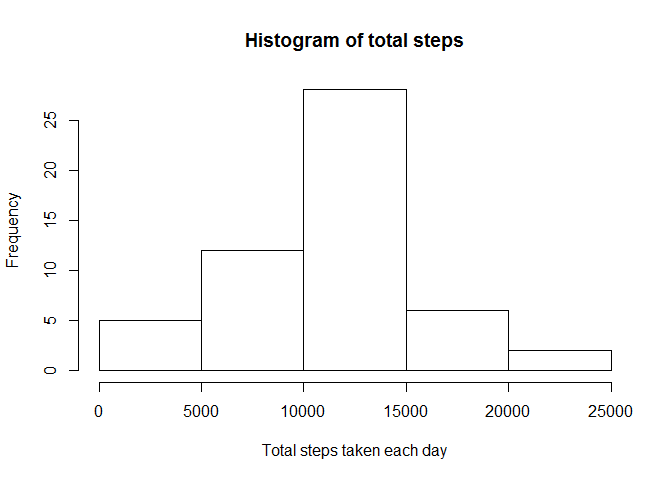
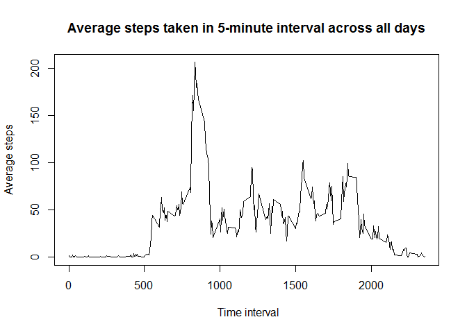
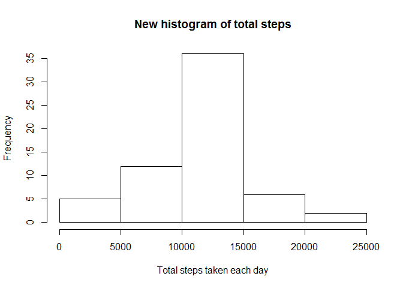
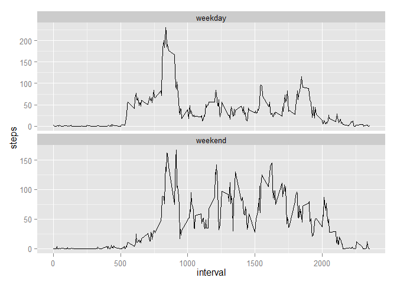

# Reproducible Research: Peer Assessment 1

##Loading and preprocessing the data
For the assignment, we need first load the data.


```r
setwd("C:\\Users\\msqi\\Documents\\GitHub\\RepData_PeerAssessment1")
act <- read.csv("activity.csv")
```
The class of the variable *date* is factor, so we need change it to time. 

```r
act$date  <- as.Date(act$date, format = "%Y-%m-%d")
```
##What is mean total number of steps taken per day?  
We need make a histogram to show the total number of steps taken each day.

```r
stepday <- tapply(act$steps, act$date,sum)
hist(stepday, main=("Histogram of total steps"), xlab= ("Total steps taken each day"))
```

 

     
So the **mean** total number of steps taken per day is 1.0766 &times; 10<sup>4</sup> and the **median** total number of steps taken per day is 10765.  

##What is the average daily activity pattern?
Average steps taken in 5-minute interval across all days.

```r
int <- tapply(act$steps, act$interval, mean, na.rm = TRUE)
plot(act$interval[1:288],int, type="l", xlab =" Time interval", ylab = "Average steps", main="Average steps taken in 5-minute interval across all days")
```

 
       
       
       
Based on this, the maximum number of steps in 5-minute interval across all days averagely happen at 835.

##Imputing missing values
The total number of missing values is 2304.   

The means for that 5-minute interval are used for filling the missing values.


```r
int1 <- rep(int,61)
act1 <- cbind(act,int1)
act1$steps[is.na(act1$steps)] <- act1$int1[is.na(act1$steps)]
```


A new histogram of the total number of steps taken each day can be generated.

```r
stepday1 <- tapply(act1$steps, act1$date,sum)
hist(stepday1, main=("New histogram of total steps"), xlab= ("Total steps taken each day"))
```

 
    
    
So the new **mean** total number of steps taken per day is 1.0766 &times; 10<sup>4</sup> and the new **median** total number of steps taken per day is 1.0766 &times; 10<sup>4</sup>. These two numbers seem really similar to the previous ones. So this filling approach has little impact on the estimates of the total daily number of steps.

   
##Are there differences in activity patterns between weekdays and weekends?
To answer this question, we need create a new variable -- w.


```r
w <- weekdays(act1$date, abbreviate = TRUE)
w[w =="Mon" | w == "Tue"| w =="Wed"| w =="Thu"| w =="Fri"]  <- "weekday"
w[w =="Sat" | w == "Sun"]  <- "weekend"
w <- as.factor(w)
act2 <- cbind(act1,w)
```

Then we can generate a new figure to compare the activity patterns between weekdays and weekends


```r
library("ggplot2", lib.loc="~/R/win-library/3.1")
library(reshape2)
int2 <- with(act2, tapply(steps, list(interval, w), mean))
int3 <- melt(int2)
colnames(int3) <- c("interval","w","steps")
ggplot(int3, aes(x = interval, y = steps))+geom_line()+facet_wrap(~w, scales="free_y", ncol =1)
```

 

